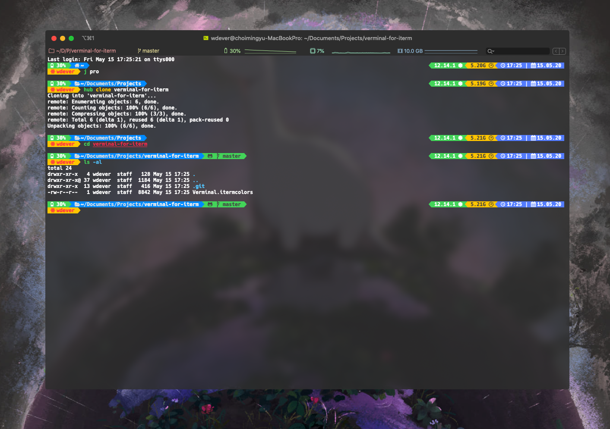

# Verminal for Iterm2

This is Iterm2 color scheme that inspired by [Verminal](https://github.com/defringe/verminal) and [Therminal](https://github.com/stleamist/Therminal)

## Installation

1. Download the `Verminal.itermcolor` with [this link](https://github.com/WDever/verminal-for-iterm/releases/latest) or clone this repo
2. Double-click `Verminal.itermcolor` to import to Iterm2
3. Open Iterm2 and go to Preferences > Profiles > Colors
4. Click **Color Presets...** and choose `Verminal`

## Contribution

I know that this color scheme doesn't look perfectly with Original [Verminal](https://github.com/defringe/verminal). So I'm waiting for the contribution.

Thanks.
